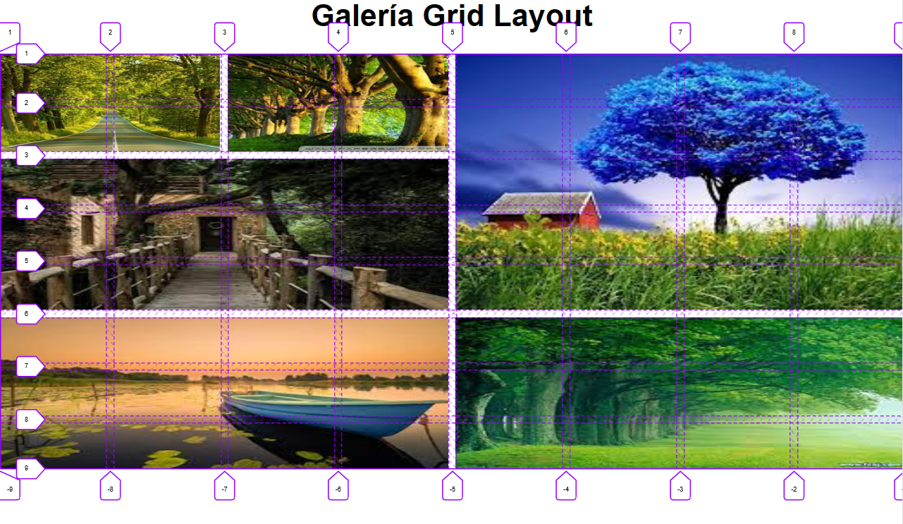
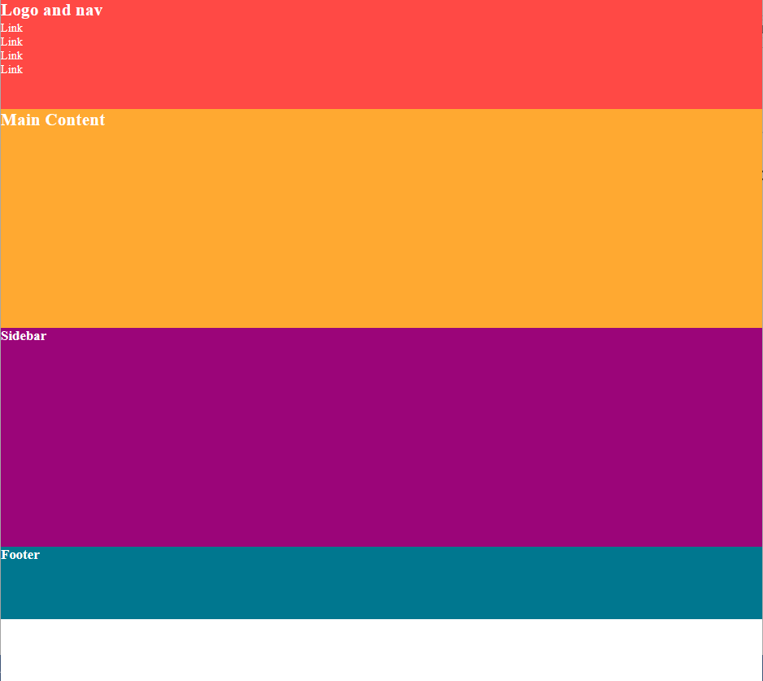
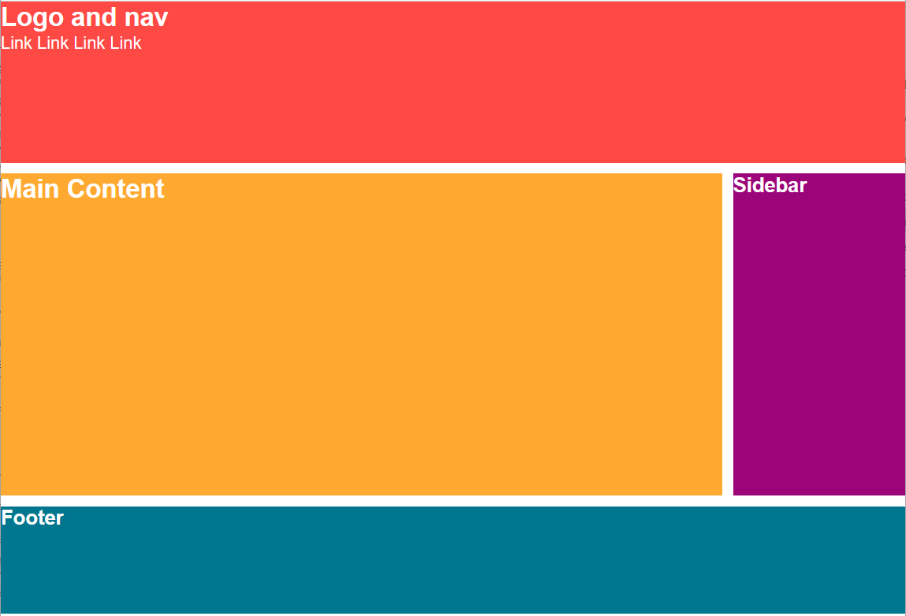
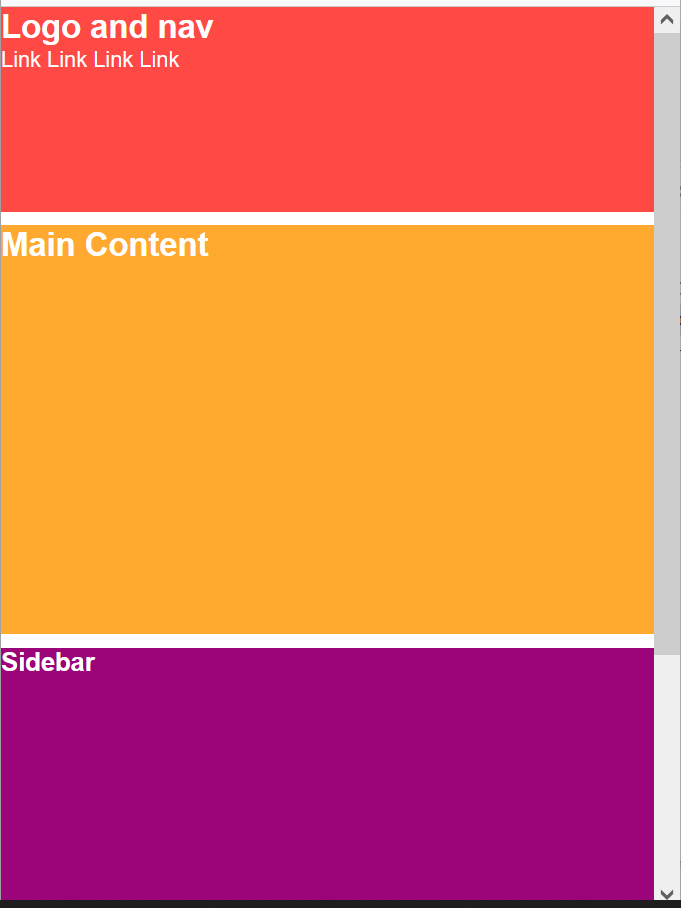

# Práctica 4.7 CSS Grid 

## Parte 1

1. Finaliza el tutorial de **Grid Essentials** de **Codecademy** de la parte de *Learn Intermediate CSS* y captura la finalización de dicho módulo desde tu cuenta.  
      
      
      
    

2. Resuelve y practica con los ejercicios Grid planteados en **GridGarden** <https://cssgridgarden.com/>

## Parte 2

Partiendo del modelo de galería que creaste en Flexbox, simplifícala para usar *Grid* a un solo tamaño y usando la **delimitación de zonas** para ajustar imágenes de forma irregular en la rejilla.

## Parte 3

Dado el código *HTML* y *CSS* adjunto en la *parte 3* con la siguiente apariencia:

Modifícalo mediante Grid para que tenga la apariencia de los siguientes 4 elementos ordenados según la imagen usando tu propia apariencia en CSS:

Mejóralo de forma **responsive** para que con una resolución menor de *660px* se muestre en una sola columna.

